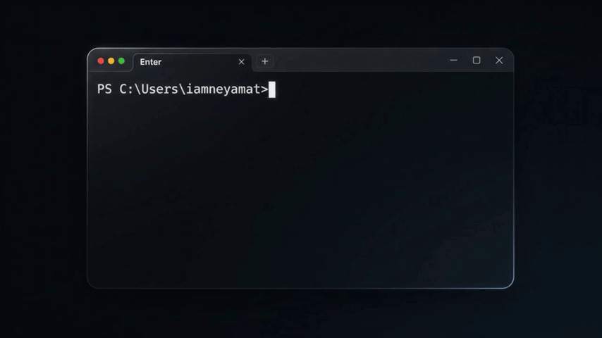

# 🤫 yap-less

[](https://www.npmjs.com/package/yap-less)
[](https://opensource.org/licenses/MIT)

> **Stop burning tokens on agent yap. Get pure code diffs instantly.**

AI coding agents (like Cursor, Windsurf, or Copilot) are incredibly smart, but they talk too much. They waste time and API tokens writing long introductions, explanations, and summaries when all you need is the **code**.

`yap-less` is a zero-config, 1-click CLI tool that injects a strict set of rules into your project, forcing AI agents to output ONLY pure code, diffs, and terminal commands.

---

## 🚀 See it in Action



## ⚡ The Problem vs. The Solution

### ❌ Without yap-less (Token Waste)
> **Agent:** "Certainly! I understand you want to update the button color. Based on the current architecture, we need to modify the CSS file. Here is the code you requested: 
> `[Code Block]` 
> Let me know if you need any further assistance with this implementation!"

### ✅ With yap-less (Pure Productivity)
> **Agent:** 
> `[Code Block]`

## 📦 Installation & Usage

No complex setup, no API keys, no messy global installations. Just run this single command in your project's root directory:

```bash
npx yap-less
```

### What does it do?
It instantly generates a highly optimized `.cursorrules` (or `rules.md`) file in your current directory. Once this file is present, any AI coding agent reading your workspace will immediately switch to **Zero-Yap Mode**.

## 🧠 Core Directives Injected
When you run the tool, it enforces the following rules on your AI:
1. **No Explanations:** Thought processes are bypassed unless explicitly requested.
2. **No Intros/Outros:** Greetings and polite filler text are strictly banned.
3. **Pure Diffs/Code:** Only actionable code blocks or terminal commands are outputted.
4. **Specific File Paths:** Always includes the target file path at the top of the code block.

## 🤝 Contributing
Want to add support for specific frameworks or IDEs? Pull requests are highly welcome! 
1. Fork the project
2. Create your feature branch (`git checkout -b feature/AmazingFeature`)
3. Commit your changes (`git commit -m 'Add some AmazingFeature'`)
4. Push to the branch (`git push origin feature/AmazingFeature`)
5. Open a Pull Request
